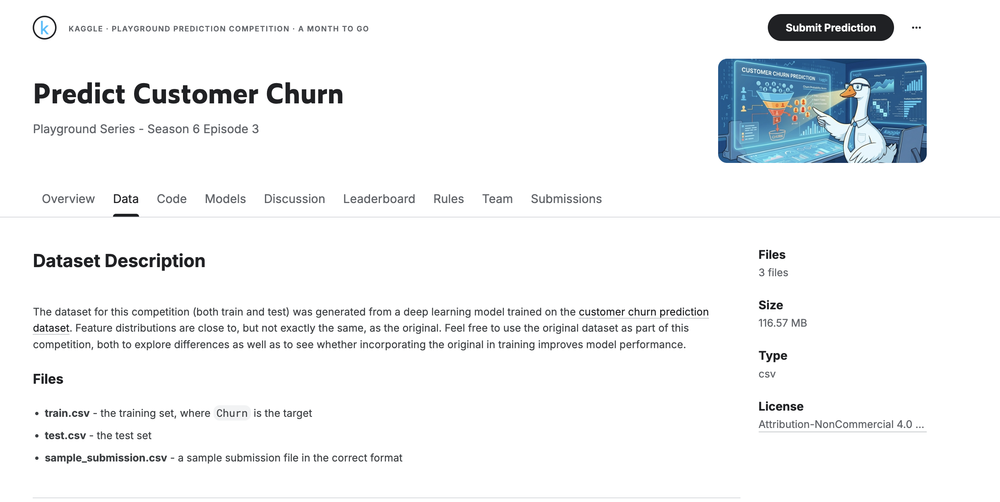
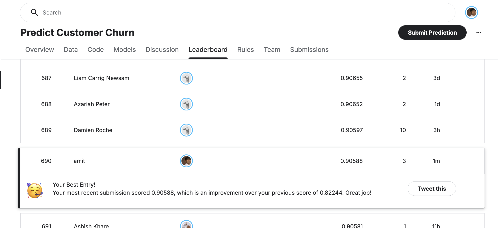

# Churn Project - Kaggle Competition
This is a binary classification project. 

Exploratory Data Analysis: https://nbviewer.org/github/amitshankar/Project01/blob/main/01%20EDA.ipynb
Training, testing and finalizing a model: https://nbviewer.org/github/amitshankar/Project01/blob/main/02%20Model_Generation.ipynb
Generating prediction data for Kaggle submission: https://nbviewer.org/github/amitshankar/Project01/blob/main/03%20Submisison_Generation.ipynb
Navigation URL for HTML representation : https://nbviewer.org/github/amitshankar/Project01/tree/main/

What I learned from this project?
My cross validation score using 'roc_auc' closely matched the score by Kaggle. 

What I disliked about this project?
The dataset contains 445,645 rows of data. My system has 16gb memormy with 6 cores and I found running other algorithms to be very resource intensive. 

What I would do different next time?
I would use feature engineering and use fewer features.

Kaggle Competition Link: https://www.kaggle.com/competitions/playground-series-s6e3/data 

Scored 0.90 on simple logistic model

